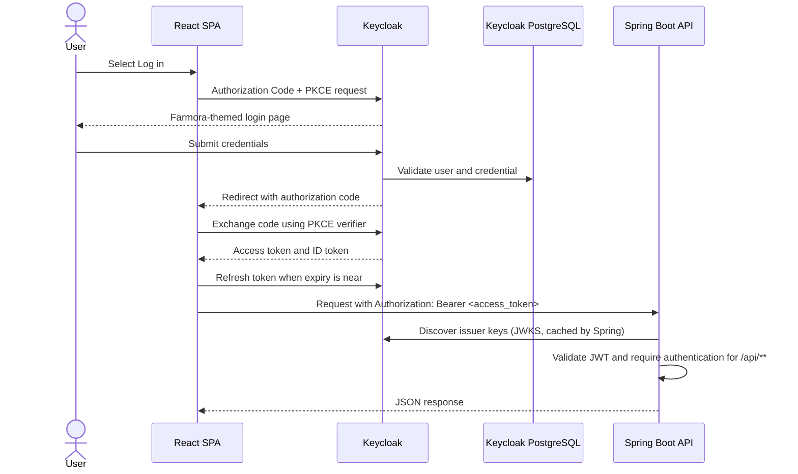

# Authentication Architecture

This document describes the current local authentication integration. Keycloak owns user identity and credentials; the React app is an OAuth public client; Spring Boot is an OAuth2 resource server.

## Components

| Component | Responsibility | Local address/config |
| --- | --- | --- |
| React + Vite | Landing page, starts login/register, holds the browser session, calls the API | `http://localhost:5173` |
| `keycloak-js` | OIDC Authorization Code flow with PKCE, callback processing, token refresh, logout | `frontend/src/lib/keycloak.ts` |
| Keycloak | Login, registration, password reset, user identity and `account_type` profile field | `http://localhost:8081`, realm `agri-platform`, client `farmora-web` |
| PostgreSQL | Persistent storage for Keycloak realms, clients, users, and credentials | Compose-only service; not published to the host |
| Spring Boot | REST API, JWT signature/issuer/expiry validation, API authentication | `http://localhost:8082` |

## Login and API request

The frontend initializes Keycloak once in `frontend/src/main.tsx` using `check-sso` and PKCE `S256`. Login and registration buttons call `keycloak.login()` and `keycloak.register()`; Keycloak returns the browser to `http://localhost:5173/`. The SPA does not collect or send passwords to Spring Boot.

`frontend/src/lib/api.ts` provides `apiFetch()`. It obtains a token through `getAccessToken()`, refreshes it when it has less than 30 seconds remaining, and adds the Bearer header. Authenticated API calls should use this helper rather than raw `fetch`.

## Registration and account type

Keycloak registration collects username, password, email, first name, last name, and the required `account_type` choice:

- `BUYER`
- `PRODUCER`
- `LOGISTICS`

The choices are a Keycloak User Profile attribute, configured in `docker/keycloak/user-profile.json`. They are user-category metadata, not Keycloak permissions. The profile file is separate from the realm-import directory and must be applied once to each realm; see [local setup](../setup/README.md).

The current client has no protocol mapper for `account_type`, so this attribute is not currently included in the access token. The current backend also has no profile database or account-type authorization rules. If later features need the value in API code, add a deliberate claim mapper or store/sync it in an application-owned profile table keyed by Keycloak `sub`.

## Current API security

`backend/src/main/java/com/agrisupply/platform/config/SecurityConfig.java` configures a stateless OAuth2 resource server:

- `GET /api/health` is public.
- `/api/**` requires a valid Keycloak JWT.
- Other routes are currently permitted.
- CORS allows the configured frontend origin, defaulting to `http://localhost:5173`.
- Spring validates tokens against `KEYCLOAK_ISSUER_URI`, defaulting to `http://localhost:8081/realms/agri-platform`.

There are no Keycloak realm/client roles or Spring `hasRole` rules configured yet. Adding `account_type` does not grant or restrict API access. For authorization, define explicit client roles, include them in tokens, map the claims to Spring authorities, and add endpoint rules. Do not let the public SPA assign privileged roles such as admin.

## Theme and password reset

The custom theme is `docker/keycloak/themes/farmora/login`. It extends Keycloak's `keycloak.v2` theme and reuses `frontend/src/assets/logo.png` and `auth-pic.jpg` via Compose mounts. `auth-transition.js` reuses Keycloak's own login/register action URLs and animates the theme panel between those screens. Forgot Password stays on the sign-in layout and uses Keycloak's native reset-credentials flow.

The reset screen can only send reset emails after SMTP is configured in the realm. Local development currently does not configure an SMTP server.

## Important files

- `frontend/src/lib/keycloak.ts`: OIDC client, login/register/logout, token refresh
- `frontend/src/lib/api.ts`: API requests with Bearer token
- `backend/src/main/resources/application.yml`: API port, issuer, and CORS origin
- `backend/src/main/java/com/agrisupply/platform/config/SecurityConfig.java`: current API access rules
- `docker/keycloak/realms/agri-platform-realm.json`: first-import realm and SPA client
- `docker/keycloak/user-profile.json`: registration profile including `account_type`
- `docker/keycloak/themes/farmora/login/`: login/register/reset theme and transition